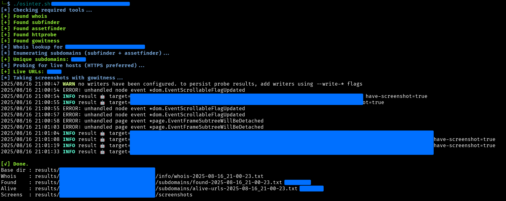
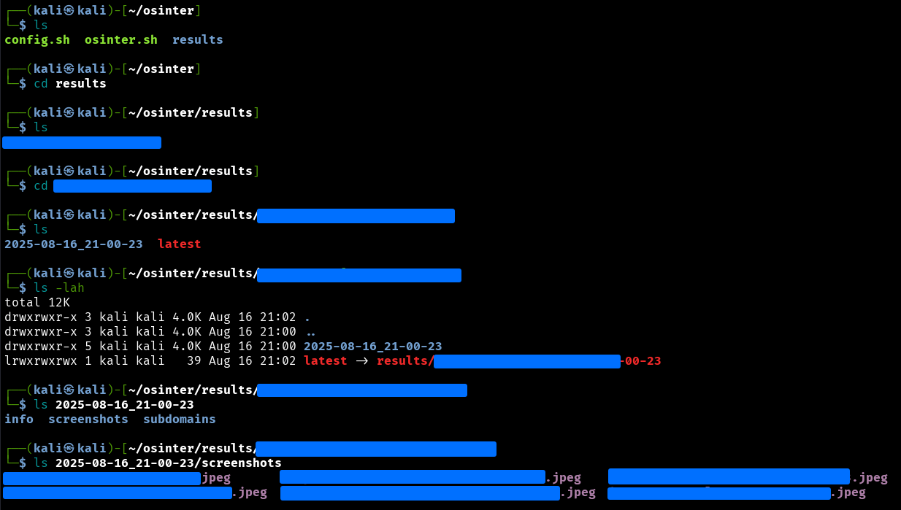

# OSinter 🔎

`OSinter` is a **Web OSINT automation tool** for domain reconnaissance.  
It automates subdomain discovery, WHOIS lookups, and live host detection, and organizes results per domain.

> Inspired by the OSINT exercises in the TCM Security course, and enhanced with per-domain timestamped folders, a `latest` symlink for quick access, and a configuration installer for dependencies.

## Features

- WHOIS lookup and domain info saved automatically  
- Subdomain enumeration using `subfinder` + `assetfinder`  
- Live host detection (HTTPS preferred) with `httprobe`  
- Automatic screenshots of live websites via `gowitness`  
- Organized results per domain with timestamped folders  
- `latest` symlink points to the most recent scan  
- Config script (`config.sh`) installs necessary tools if missing

## Screenshots

Here are examples showing OSinter in action, including terminal output and the resulting folder structure after a scan:





## Requirements

- Linux (tested on Kali Linux)
- Bash shell
- Installed tools via ```config.sh``` (```whois```, ```subfinder```, ```assetfinder```, ```httprobe```, ```gowitness```)
- Internet connection

## Installation

Clone the repository:
```bash
git clone https://github.com/RaihanAkram/osinter.git
cd osinter
```
Make scripts executable:
```bash
chmod +x config.sh osinter.sh
```
Run the config script to install dependencies:
```bash
./config.sh
```

## Usage

Scan a domain:
```bash
./osinter.sh example.com
```
Results will be saved under:
```bash
results/example.com/<timestamp>/
```
Notes:
- Running without arguments shows usage: ```Usage: ./osinter.sh <domain>```
- Re-running the same domain creates a new timestamped folder and updates the latest ```symlink

## Inspiration & Enhancements

This tool is inspired by the OSINT exercises in the **TCM Security OSINT course**.  
While it is a basic version, it has been enhanced for better organization and usability.

Users can further extend OSinter by:
- Adjusting the configuration to use different **wordlists** for subdomain enumeration  
- Adding **API keys** for tools that support them (e.g., VirusTotal, Shodan)  
- Integrating additional OSINT tools or modules for deeper reconnaissance  
- Modifying output formatting or report generation to suit personal workflows

These enhancements allow the tool to grow beyond its current basic setup while maintaining simplicity for beginners.

## Disclaimer ⚠️

This project is for educational and authorized security testing only.
Do not target systems you don’t own or have explicit permission to test.
The author assumes no liability for misuse.


